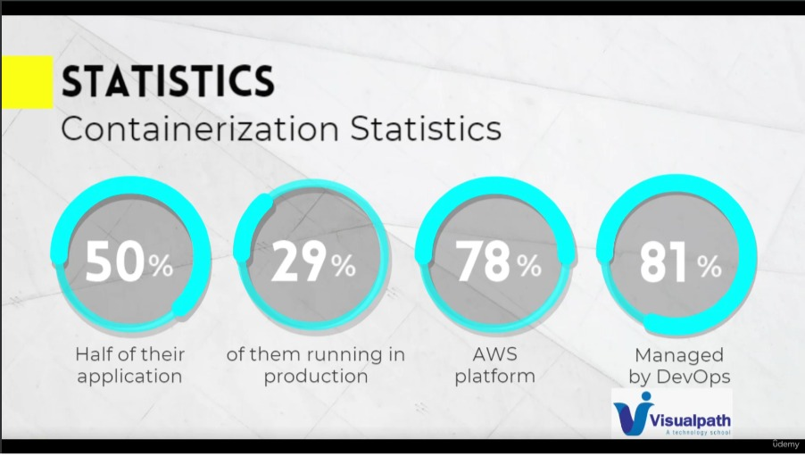
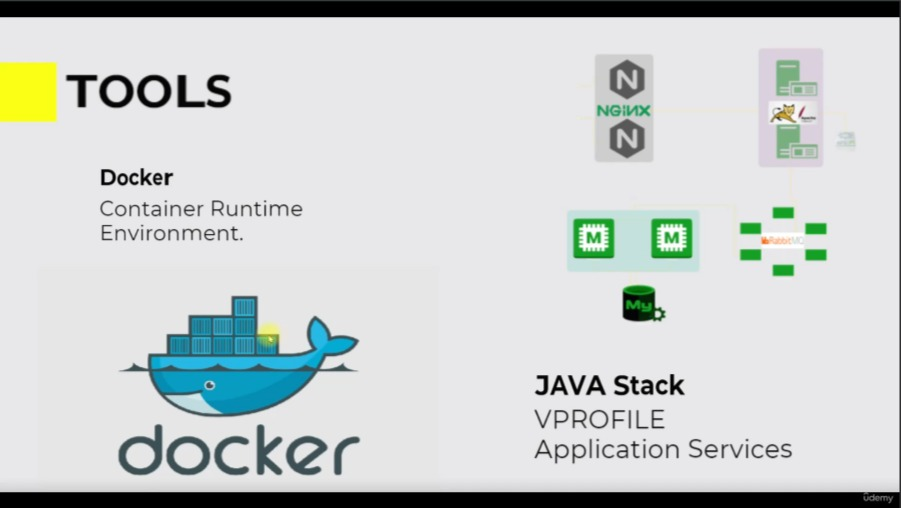
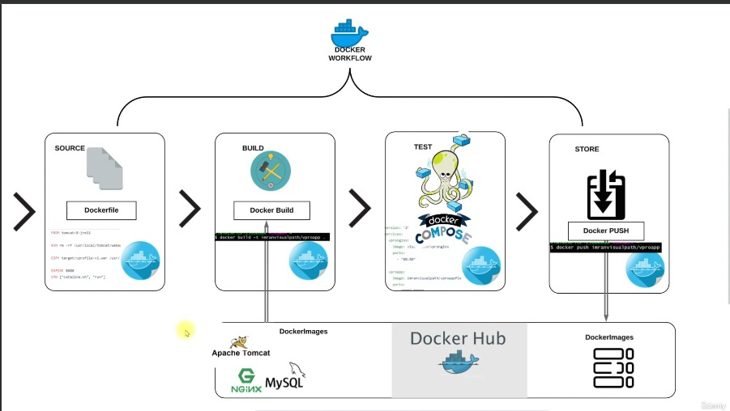

**Conteneurisation**
=====================================

|Plan|
|---------------------|
Présentation
Présentation de l'image de base
Configuration Dockerhub
Configurer le moteur Docker
Références Dockerhub et Dockerfile
Fichier Docker d'image d'application
Fichier Docker d'image de base de données
Fichier Docker d'image Web
Docker composer
Construire et exécuter
Résumer
Projet de conteneurisation de microservices
Créer et exécuter une application de microservice

# Présentation

#### **1) Conteneurisation de l'application**

   + Scénario

     + Pile d'applications à plusieurs niveaux
     + Exécution sur VM
     + Déploiement régulier
     + Changements continus

   + Problème

     + CapEx et OpEx élevés
     + Erreurs humaines dans le déploiement
     + Non compatible avec l'architecture des microservices
     + Gaspillage de ressources
     + Non portable, Env non synchronisé
  
   + Solution 1 :

     + Conteneurs
     + Consomme peu de ressources
     + Convient très bien à la conception de microservices

   + Solution 2 :

     + Déploiement via des images
     + Images de conteneur identiques dans tous les environnements
     + Réutilisable et reproductible

#### **2) STATISTIQUES**

+ Statistiques de conteneurisation

 

#### **3) ETAPES**
+ Étapes pour configurer nos services de pile
+ Trouver la bonne image de base de dockerhub
+ Écrire Dockerfile pour personnaliser les images
+ Écrire le fichier `docker-compose.yml` pour exécuter des multi-conteneurs
+ Testez-le et hébergez des images sur Dockerhub

# Synthèse 

# Documentation

+ [EtixiCode-Dockerhub](https://hub.docker.com/repositories/etixicode)
+ [Docker Organization](https://hub.docker.com/billing/core/purchase?type=organization)
+ [Vagrant](https://app.vagrantup.com/bento/boxes/ubuntu-22.04)
+ [Docker Ubuntu](https://docs.docker.com/engine/install/ubuntu/)

